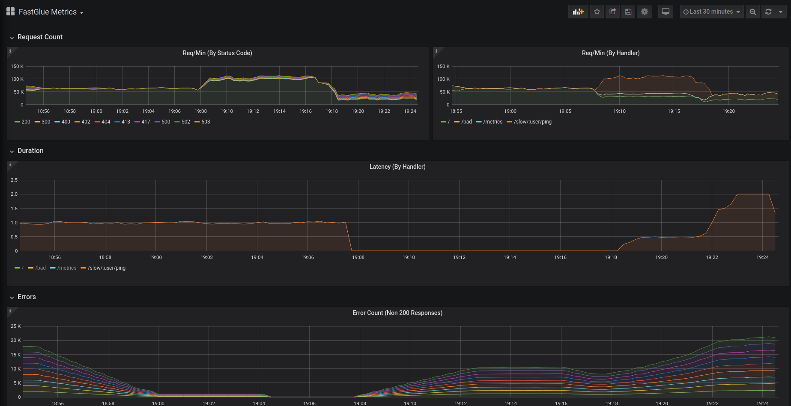

# fastglue-metrics



## Overview

This package provides an easy way to collect HTTP metrics from any Golang application using the package `fastglue`. It uses Fastglue's middlewares `Before` and `After` to collect metadata about the request such as request count, response time, response size. The package is inspired from `RED` principles of service monitoring. The components of this monitoring philosophy are:

- **Rate** (the number of requests per second)
- **Errors** (the number of those requests that are failing)
- **Duration** (the amount of time those requests take)

All the metrics are grouped by the following labels:

- **status** (HTTP Status Code)
- **path** (The original request path used while registering the handler)
- **method** (HTTP Method)

## Usage

`go get REDACTED/fastglue-metrics`

To start collecting metrics, simply initialise the metric exporter:

```go
// Initialize fastglue.
g := fastglue.NewGlue()
// Initialise fastglue-metrics exporter.
exporter := metrics.NewMetrics(g)
// Expose the registered metrics at `/metrics` path.
g.GET("/metrics", exporter.HandleMetrics)
```

### Additional Options

You can pass additional options to configure the behaviour of exporter using `fastgluemetrics.Opts`.

```go
// Pass additional options
exporter := fastgluemetrics.NewMetrics(g, fastgluemetrics.Opts{
    ExposeGoMetrics:       true,
    NormalizeHTTPStatus:   false,
    ServiceName: "dummy",
})
```

To see a fully working example, you can check [examples/main](examples/main.go).

## Configuration

`metrics.Options` takes in additional configurtion to customise the behaviour of exposition.

- **ServiceName**: Unique identifier for the service name.

- **NormalizeHTTPStatus**: If multiple status codes like `400`,`404`,`413` are present, setting this to `true` will make them group under their parent category i.e. `4xx`.

- **ExposeGoMetrics**: Setting this to `true` would expose various `go_*` and `process_*` metrics.

- **MatchedRoutePathParam**: If the value is set, the `path` variable in metric label will be the one used while registering the handler. If the value is unset, the original request path is used.

    **Note**:
    If your application has dynamic endpoints, which make use of the `Named Params` in fasthttp router, you **must** set this value. If the value is not set, then a new metric will be created for each dynamic value of the named parameter, thus impacting the performance of external monitoring systems.
    For example, for a route `/orders/:userid/fetch`, you don't want a million timeseries metrics to be created for each user.
    `fasthttprouter` would set the value of matched path in `ctx.UserValue` with a **key**. This setting is the value of that key, which is exposed in `fastglue` package with the variable name: `MatchedRoutePathParam`.

### Victoria Metrics vs Prometheus

This package uses [VictoriaMetrics/metrics](https://github.com/VictoriaMetrics/metrics) which is an extremely lightweight alternative to the official Prometheus client library. The official library pulls a lot of external dependencies, does a lot of magic and has features we don't really need for our simple use case. Besides being performant, `VM/metrics` has several improvements and optimisations on how a `Histogram` metric is constructed. For more details, you can read [this](https://medium.com/@valyala/improving-histogram-usability-for-prometheus-and-grafana-bc7e5df0e350).
